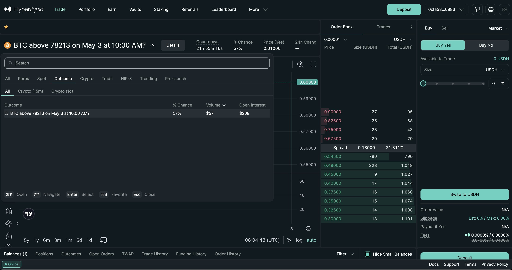

# 🔁 Hyperliquid Prediction Markets Copy Trading Bot

Hyperliquid prediction markets copy trading bot is an automated trading system designed to replicate the trading strategies of successful Hyperliquid L1 traders in real-time. A straightforward, high-speed copy trading bot for **Hyperliquid**.

<div align="center">
  <a href="../../releases/latest">
    
  </a>
</div>

---

## Overview

This bot monitors selected Hyperliquid L1 addresses in real time via WebSockets and **automatically mirrors their prediction market trades**.  

Perfect for users who want a **simple, lightning-fast, and reliable** copy-trading setup natively on the Hyperliquid L1.

---
```text
hyperliquid-copy-bot/
│
├── src/
│   ├── copytrading.py
│   ├── watcher.py
│   ├── interpreter.py
│   ├── sizing.py
│   ├── executor.py
│   ├── risk.py
│   ├── hl_l1_api.py
│   ├── config.py
│   └── main.py
│
├── requirements.txt
```
---
## Core Features

- **Auto Copy Trading** — automatically replicates trades from a target Hyperliquid address.  
- **Risk Controls** — adjustable leverage, margin limits, retry limits, and slippage tolerance.  
- **MongoDB Logging** — logs trades, L1 state changes, and system events for debugging and analytics.  
- **Simple Configuration** — all API keys and settings managed through a `.env` file.

### Real-Time Wallet Mirroring

> The bot continuously monitors target addresses using Hyperliquid WebSockets: detects orderbook trades instantly, identifies the prediction asset (e.g., HYPE-TGE, TRUMP), direction (Long/Short Yes/No), and size, executes mirrored trades within <50ms, and uses asynchronous processing to match the L1 block speed.

---

### 2. Position Scaling

Choose how the bot sizes your trades (using USDC collateral):

**Proportional Mode:**
$$YourStake = \left( \frac{YourBank}{TraderBank} \right) \times TraderStake$$

**Fixed Allocation Mode:**
Always bet **$X** per trade

Includes:
- Min/max USDC trade size  
- Orderbook liquidity checks  
- Event-level exposure limits  

---

### 3. Multi-Wallet Copying

Copy multiple Hyperliquid L1 addresses at once.  
You can set:

- Equal weights  
- Custom weights  
- Per-wallet limits  

The bot will open/close positions in sync with each tracked address.

---

### 4. Fail-Safe Execution Layer

Built for on-chain reliability:

- No duplicate orders  
- Automatic retries on L1 network congestion  
- Handles Hyperliquid WebSocket drops and auto-reconnects  
- Auto-exit when the original address closes their position  

---

## ⚙️ Architecture (Simplified)

```text
+------------------------------+
|       L1 State Watcher       |
| Real-time WS address stream  |
+--------------+---------------+
               |
               v
+------------------------------+
|      Trade Interpreter       |
| Detect asset, direction, $   |
+--------------+---------------+
               |
               v
+------------------------------+
|    Position Sizing Engine    |
| Scale or fixed USDC alloc    |
+--------------+---------------+
               |
               v
+------------------------------+
|        Trade Executor        |
| Market/limit L1 transaction  |
+--------------+---------------+
               |
               v
      Hyperliquid L1 L2 API
```

---
## Example Copy Script

1. A tracked address buys **"Long TRUMP" (Yes on Trump win)** at $0.48.
2. Bot detects the trade instantly via the L1 user state WebSocket.
3. Your sizing rule is applied (e.g., **$50** fixed).
4. The bot signs and sends the mirrored trade within ~50 ms.
5. When the target address closes their position (sells), your position closes automatically.
6. Optional rule: the bot can automatically set a Take Profit order once it reaches **X% ROI**, regardless of what the tracked wallet does.

---

## Risk Controls

- Max margin per prediction market  
- Daily/weekly exposure limits  
- Maximum slippage filters  
- Per-wallet exposure caps  
- Automatic WebSocket recovery  
- Full transaction log  

---
## 🖥️ Installation and Launch

1. ✅ **Download the stable build** from the [Releases](../../releases).
2. 📁 **Extract Files**: Unzip the archive.
3. 🟢 **Run**: Launch `HL-CopyTrade_x64.7z`
---
## Tech Stack

| Layer     | Technology           |
|-----------|----------------------|
| Language  | Python 3.13+         |
| Runtime   | asyncio, uvloop      |
| Data      | Hyperliquid API + WS |
| DB        | PostgreSQL (optional)|
| Queue     | Redis / Async Queue  |
| Interface | CLI · FastAPI · Telegram Bot |

---

## License

MIT License.

---
`Copy trades fast. Copy trades directly. No extra logic — just pure L1 mirroring`
